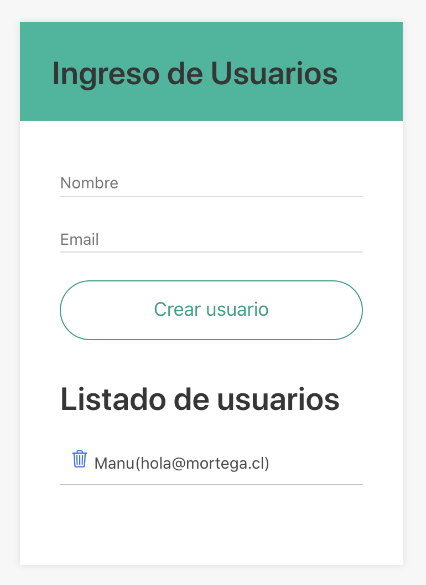
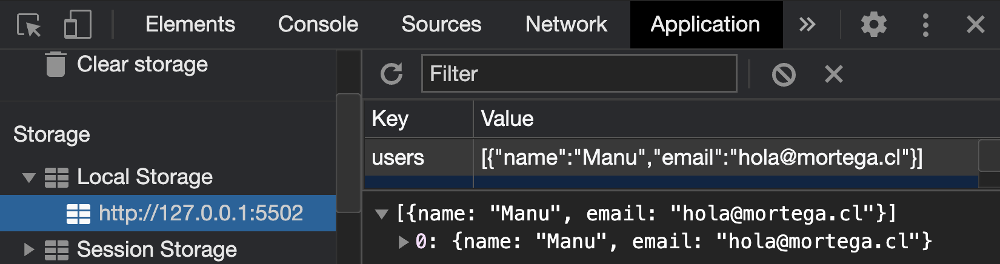

## Trabajo utilizando Javascript
Se entrega el siguiente formulario:


## Requerimiento

- 1).- Generar un fork de este proyecto a tu Github

***Utilizando Javascript debemos agregar:**

- 2).- Ingresar nuevos registros y almacenarlos en localstorage, como se visualiza en la imagen



- 3).- Eliminar usuario del html y localstorage

- 4).- Si no existen usuarios utilizar el código existe en el archivo `index.html` para mostrar el siguiente texto  `Que esperas, ingresa un Usuario`
```
<span id="notification"></span>
```


## create a new repository on the command line
```
echo "# frenon-javascript-formularios" >> README.md
git init
git add README.md
git commit -m "first commit"
git branch -M master
git remote add origin https://github.com/mortegac/frenon-javascript-formularios.git
git push -u origin master
```
                
## push an existing repository from the command line
```
git remote add origin https://github.com/mortegac/frenon-javascript-formularios.git
git branch -M master
git push -u origin master
```

